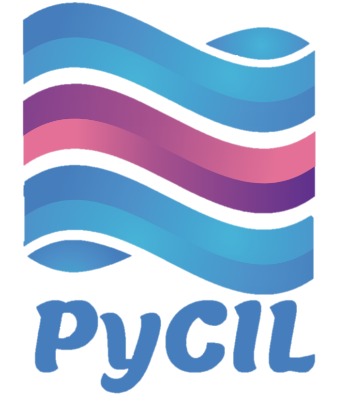
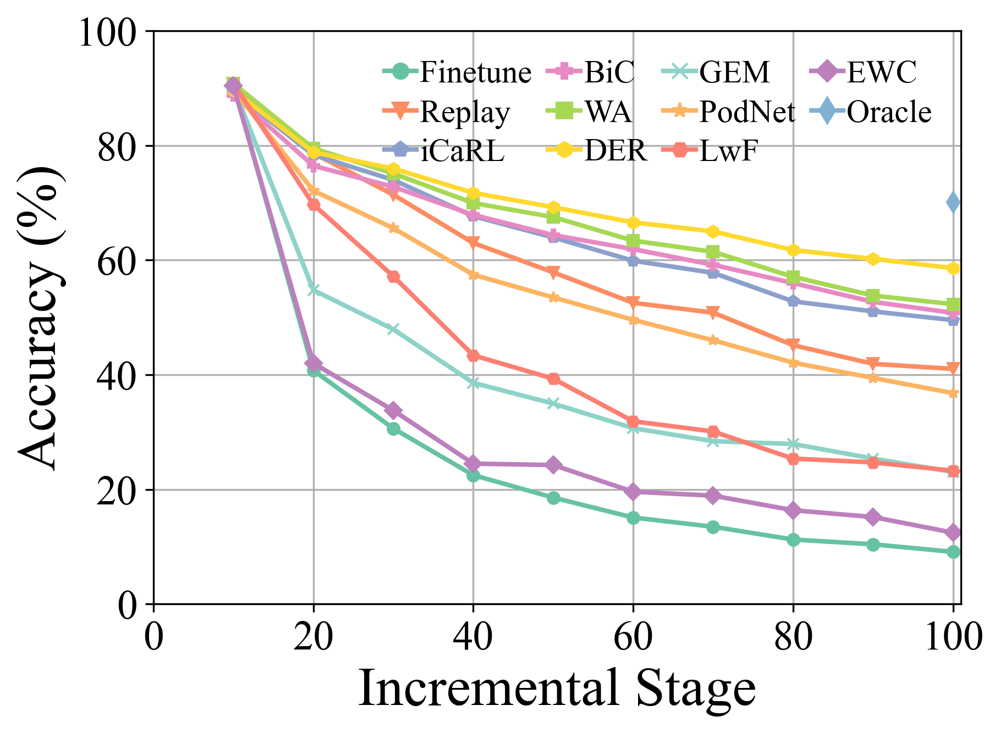
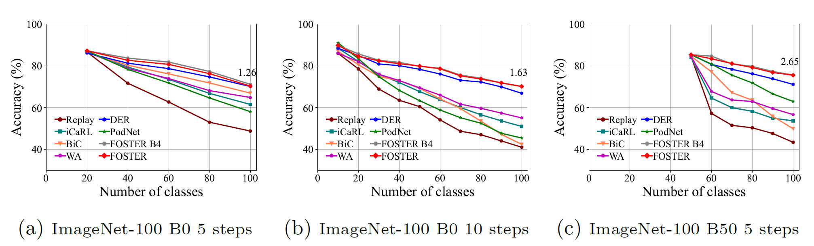
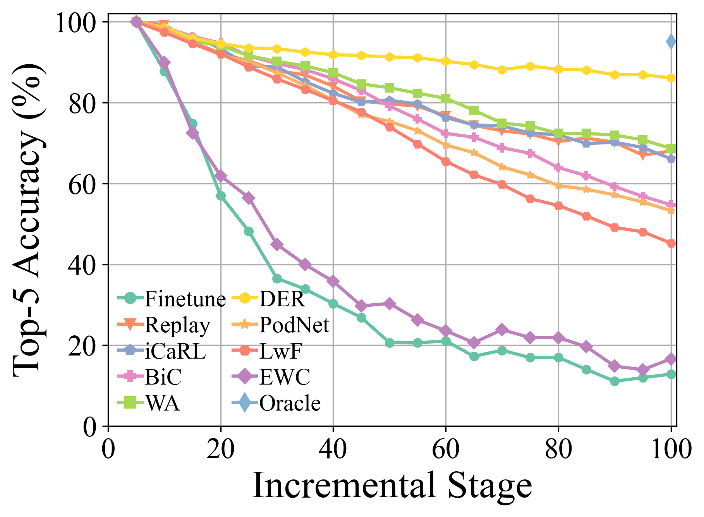

# PyCIL: A Python Toolbox for Class-Incremental Learning

---

<p align="center">
  <a href="#Introduction">Introduction</a> •
  <a href="#Methods-Reproduced">Methods Reproduced</a> •
  <a href="#Reproduced-Results">Reproduced Results</a> •  
  <a href="#how-to-use">How To Use</a> •
  <a href="#license">License</a> •
  <a href="#Acknowledgments">Acknowledgments</a> •
  <a href="#Contact">Contact</a>
</p>

<div align="center">

</div>

---

[](https://github.com/yaoyao-liu/class-incremental-learning/blob/master/LICENSE)[](https://www.python.org/) [](https://pytorch.org/) []() [](https://paperswithcode.com/task/incremental-learning)

The code repository for "PyCIL: A Python Toolbox for Class-Incremental Learning" [[paper]](https://arxiv.org/abs/2112.12533) in PyTorch. If you use any content of this repo for your work, please cite the following bib entry:

    @misc{zhou2021pycil,
      title={PyCIL: A Python Toolbox for Class-Incremental Learning},
      author={Da-Wei Zhou and Fu-Yun Wang and Han-Jia Ye and De-Chuan Zhan},
      year={2021},
      eprint={2112.12533},
      archivePrefix={arXiv},
      primaryClass={cs.LG}
    }

## Introduction

Traditional machine learning systems are deployed under the closed-world setting, which requires the entire training data before the offline training process. However, real-world applications often face the incoming new classes, and a model should incorporate them continually. The learning paradigm is called Class-Incremental Learning (CIL). We propose a Python toolbox that implements several key algorithms for class-incremental learning to ease the burden of researchers in the machine learning community. The toolbox contains implementations of a number of founding works of CIL, such as EWC and iCaRL, but also provides current state-of-the-art algorithms that can be used for conducting novel fundamental research. This toolbox, named PyCIL for Python Class-Incremental Learning, is open source with an MIT license.

 An introduction (in Chinese) about CIL is available [here](https://zhuanlan.zhihu.com/p/490308909).  
 A [PyTorch](https://pytorch.org/) Tutorial to Class-Incremental Learning (with explicit codes and detailed explanations) is available [here](https://github.com/G-U-N/a-PyTorch-Tutorial-to-Class-Incremental-Learning).

## Methods Reproduced

- [X] `FineTune`: Baseline method which simply updates parameters on new tasks, suffering from Catastrophic Forgetting. By default, weights corresponding to the outputs of previous classes are not updated.
- [X] `EWC`: Overcoming catastrophic forgetting in neural networks. PNAS2017 [[paper](https://arxiv.org/abs/1612.00796)]
- [X] `LwF`:  Learning without Forgetting. ECCV2016 [[paper](https://arxiv.org/abs/1606.09282)]
- [X] `Replay`: Baseline method with exemplars.
- [X] `GEM`: Gradient Episodic Memory for Continual Learning. NIPS2017 [[paper](https://arxiv.org/abs/1706.08840)]
- [X] `iCaRL`: Incremental Classifier and Representation Learning. CVPR2017 [[paper](https://arxiv.org/abs/1611.07725)]
- [X] `BiC`: Large Scale Incremental Learning. CVPR2019 [[paper](https://arxiv.org/abs/1905.13260)]
- [X] `WA`: Maintaining Discrimination and Fairness in Class Incremental Learning. CVPR2020 [[paper](https://arxiv.org/abs/1911.07053)]
- [X] `PODNet`: PODNet: Pooled Outputs Distillation for Small-Tasks Incremental Learning. ECCV2020 [[paper](https://arxiv.org/abs/2004.13513)]
- [X] `DER`: DER: Dynamically Expandable Representation for Class Incremental Learning. CVPR2021 [[paper](https://arxiv.org/abs/2103.16788)]
- [X] `RMM`: RMM: Reinforced Memory Management for Class-Incremental Learning. NeurIPS2021 [[paper](https://proceedings.neurips.cc/paper/2021/hash/1cbcaa5abbb6b70f378a3a03d0c26386-Abstract.html)] (We already implemented `iCaRL+RMM`, `FOSTER+RMM` in [rmm.py](models/rmm.py).)
- [X] `Coil`: Co-Transport for Class-Incremental Learning. ACM MM2021 [[paper](https://arxiv.org/abs/2107.12654)]
- [X] `FOSTER`: Feature Boosting and Compression for Class-incremental Learning. ECCV 2022 [[paper](https://arxiv.org/abs/2204.04662)]


## Reproduced Results

#### CIFAR-100

<div align="center">

</div>

#### ImageNet-100 Top-1 Accuracy

<div align="center">

</div>

#### ImageNet-100 Top-5 Accuracy

<div align="center">

</div>

> More experimental details and results are shown in our [paper](https://arxiv.org/abs/2112.12533).

## How To Use

### Clone

Clone this GitHub repository:

```
git clone https://github.com/G-U-N/PyCIL.git
cd PyCIL
```

### Dependencies

1. [torch 1.81](https://github.com/pytorch/pytorch)
2. [torchvision 0.6.0](https://github.com/pytorch/vision)
3. [tqdm](https://github.com/tqdm/tqdm)
4. [numpy](https://github.com/numpy/numpy)
5. [scipy](https://github.com/scipy/scipy)
6. [quadprog](https://github.com/quadprog/quadprog)

### Run experiment

1. Edit the `[MODEL NAME].json` file for global settings.
2. Edit the hyperparameters in the corresponding `[MODEL NAME].py` file (e.g., `models/icarl.py`).
3. Run:

```bash
python main.py --config=./exps/[MODEL NAME].json
```

where [MODEL NAME] should be chosen from `finetune`, `ewc`, `lwf`, `replay`, `gem`,  `icarl`, `bic`, `wa`, `podnet`, `der`.

4. `hyper-parameters`

When using PyCIL, you can edit the global parameters and algorithm-specific hyper-parameter in the corresponding json file.

These parameters include:

- **memory-size**: The total exemplar number in the incremental learning process. Assuming there are $K$ classes at the current stage, the model will preserve $\left[\frac{memory-size}{K}\right]$ exemplar per class.
- **init-cls**: The number of classes in the first incremental stage. Since there are different settings in CIL with a different number of classes in the first stage, our framework enables different choices to define the initial stage.
- **increment**: The number of classes in each incremental stage $i$, $i$ > 1. By default, the number of classes per incremental stage is equivalent per stage.
- **convnet-type**: The backbone network for the incremental model. According to the benchmark setting, `ResNet32` is utilized for `CIFAR100`, and `ResNet18` is used for `ImageNet`.
- **seed**: The random seed adopted for shuffling the class order. According to the benchmark setting, it is set to 1993 by default.

Other parameters in terms of model optimization, e.g., batch size, optimization epoch, learning rate, learning rate decay, weight decay, milestone, and temperature, can be modified in the corresponding Python file.

### Datasets

We have implemented the pre-processing of `CIFAR100`, `imagenet100,` and `imagenet1000`. When training on `CIFAR100`, this framework will automatically download it.  When training on `imagenet100/1000`, you should specify the folder of your dataset in `utils/data.py`.

```python
    def download_data(self):
        assert 0,"You should specify the folder of your dataset"
        train_dir = '[DATA-PATH]/train/'
        test_dir = '[DATA-PATH]/val/'
```

## License

Please check the MIT  [license](./LICENSE) that is listed in this repository.

## Acknowledgments

We thank the following repos providing helpful components/functions in our work.

- [Continual-Learning-Reproduce](https://github.com/zhchuu/continual-learning-reproduce)
- [GEM](https://github.com/hursung1/GradientEpisodicMemory)
- [Proser](https://github.com/zhoudw-zdw/CVPR21-Proser)
- [Coil](https://github.com/zhoudw-zdw/MM21-Coil)
- [FACIL](https://github.com/mmasana/FACIL)

## Contact

If there are any questions, please feel free to  propose new features by opening an issue  or contact with the author: **Da-Wei Zhou**([zhoudw@lamda.nju.edu.cn](mailto:zhoudw@lamda.nju.edu.cn)) and **Fu-Yun Wang**(wangfuyun@smail.nju.edu.cn). Enjoy the code.
